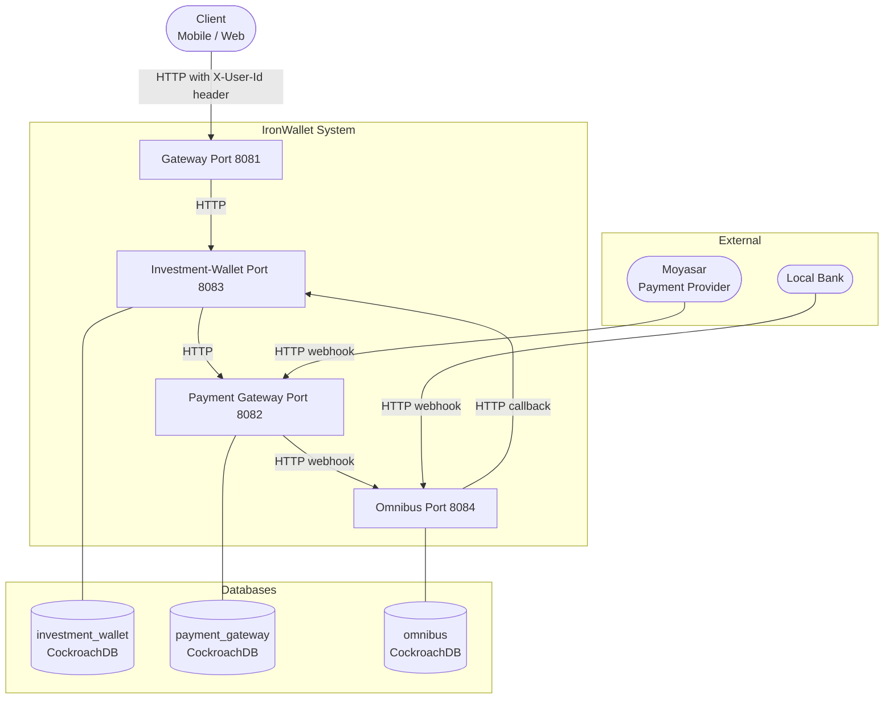
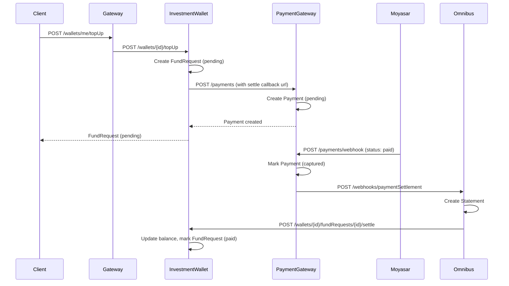
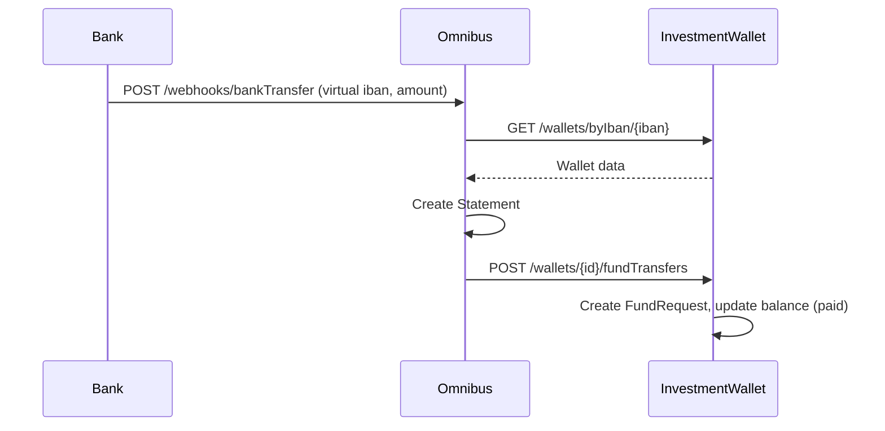

# System Architecture

## Overview

IronWallet is a microservices based investment wallet system. It is composed of four independent services, each owning its own database and communicating with others over HTTP.

---

## High-Level Component Diagram

---

## Services

### Gateway (8081)
The only entry point for client applications. Accepts a `X-User-Id` header to identify the caller, resolves the user's wallet ID, and forwards requests to Investment-Wallet. It hides internal service details from clients.

### Investment-Wallet (8083)
The core of the system. Manages wallets and fund requests. Responsible for:
- Creating wallets with unique virtual IBANs
- Initiating top up requests and coordinating with the Payment Gateway
- Settling fund requests and updating wallet balances
- Handling fund transfers triggered by the Omnibus service

### Payment Gateway (8082)
Abstracts the payment provider (Moyasar or any other provider). Receives payment creation requests from Investment-Wallet, stores the payment with a callback URL, and after receiving a successful webhook from Moyasar, triggers the settlement flow by calling Omnibus.

### Omnibus (8084)
Manages virtual account statements. Acts as the bridge between the payment world and the wallet world. Receives settlement events from Payment Gateway, creates account statements, and calls back to Investment-Wallet to finalize the balance update. Also handles incoming bank transfers via virtual IBAN.

---

## Top Up Flow

---

## Bank Transfer Flow

---

## Data Ownership

| Service | Database | Tables |
|---|---|---|
| Investment-Wallet | `investment_wallet` | `wallets`, `fund_requests` |
| Payment Gateway | `payment_gateway` | `payments` |
| Omnibus | `omnibus` | `statements` |

Each service owns its data exclusively. No service reads from another service's database directly, all cross service data access goes through HTTP.

---

## Swagger UI

| Service | URL |
|---|---|
| Gateway | http://localhost:8081/docs |
| Investment-Wallet | http://localhost:8083/docs |
| Payment Gateway | http://localhost:8082/docs |
| Omnibus | http://localhost:8084/docs |
